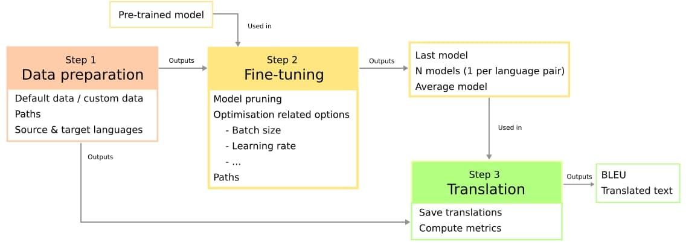

# Second adaptable pipeline for InterL

## Description

This project provides the data preparation, fine-tuning and evaluation of an [mBART model](https://arxiv.org/abs/2001.08210 "Link to the ArXiV paper") for two translation tasks: text to text (i.e. translation between different spoken languages) and text to [Abstract Meaning Representation](https://github.com/amrisi/amr-guidelines/blob/master/amr.md) (AMR).

## Installation

To clone the repository, call the `git clone` using the `-recursive` or `--recurse-submodules` option (depending on your git version), i.e.

```
git clone --recursive <repository_address>
git clone --recurse-submodules <repository_address> // OR for git version >2.12

```

Open a terminal and execute the following within the repository folder:

```
chmod +x setup.sh
./setup.sh

git clone https://github.com/LaSTUS-TALN-UPF/NMT-Evaluation
mv NMT-Evaluation NMTEvaluation

cd multilingual-text-to-amr
pip install -e .
```

## Arguments to control the pipeline

### Text-to-text

The `args.json` file contains all the necessary arguments to control the whole pipeline (preparing the data, and fine-tuning and evaluating the model). Through this documentation, any argument contained within this file will be denoted as `args.json:<name_of_argument>`, as in `args.json:batch_size`. The following figure illustrates the pipeline's workflow.



### Text-to-AMR

Within the "multilingual-text-to-amr" folder there is a `example_config.json` file that also contains many arguments to control the text-to-AMR pipeline. For all the details, check the [original repository](https://github.com/BramVanroy/multilingual-text-to-amr).

## Tex2text only: Preparing the data

This step is necessary to prepare the data for the text-to-text task. The `prepare_data.py` may download some language pairs from the ParaCrawl corpus if the `args.json:download_paracrawl_datasets` argument is set to True. Otherwise, it expects a custom dataset from the user. The paths should be set as follows:

```
<args.json:corpora_dir>/
        es-en/
                <args.json:train_mode>_es-en.txt
                <args.json:evaluation_mode>_es-en.txt
        en-es/
                <args.json:train_mode>_en-es.txt
                <args.json:evaluation_mode>_en-es.txt
```

In the above example, the English-Spanish language pair is used as example in both the English-to-Spanish and Spanish-to-English directions. However, any language pair or pairs can be used (as many as desired). The `prepare_data.py` script downloads all the pairs (such as "es-en") specified in the `args.json:paracrawl_languages` array from the ParaCrawl 7.1 corpus and prepares the train and test splits. `args.json:test_size` can be used to specify the size of the test set (with a fixed integer number), randomly subsampled from the dataset. Having the custom data prepared or `args.json:download_paracrawl_datasets` set to True, run:

```
python prepare_data.py args.json
```

The script also downloads the pre-trained mBART model, the tokeniser and the original vocabulary file. The vocabulary is computed from the dataset and is reduced to `args.json:vocabulary_size` samples (integer). Finally, the dataset is tokenised using the SentencePiece model from mBART.

After the scripts finishes, all the contents of the `<args.json:corpora_dir>/<language_pair>/temp/` folders can be deleted, as they are not necessary. Nevertheless, notice that the original train and test files are copied to that folder (they can be retrieved from there), as they are replaced by their tokenised version.       º

## Fine-tuning

### Text2text

To call the script for finetuning the model, use:

```
python train.py --mode=text2text args.json
```

There are several options within `args.json` to customise this step.

### Text2amr

```
python train.py --mode=text2amr example_config.json
```

There are several options within `example_config.json` to customise this step.

## Tex2text only: Translating and evaluation

After the model is fine-tuned, to translate the files named with the prefix `args.json:evaluation_mode` one can run:

```
python translate.py args.json
```

They will be saved in the `<args.json:output_dir>/<args.json:predictions_dir>` folder, in a specific language folder. Then, to evaluate the results one can run:

```
python evaluate.py args.json
```

The results will be saved again in the folder `<args.json:output_dir>/<args.json:predictions_dir>`, in a specific language folder.

